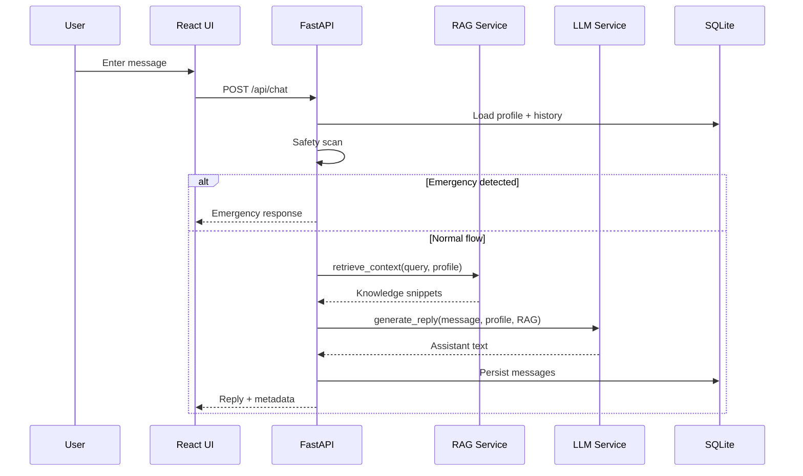

# System Architecture

## Overview

The Personalized Healthcare Assistant combines **patient-specific context** with **retrieval-augmented generation** and a **large language model** to produce tailored wellness guidance.

## Data flow

## Components

### Patient profiles

Stored in SQLite (`patient_profiles`). Fields drive personalization:

- Demographics (age, gender)
- Chronic conditions
- Current medications
- Allergies
- Health goals

### RAG layer

`knowledge_base.json` holds curated snippets (diabetes nutrition, BP lifestyle, asthma triggers, etc.). Retrieval uses token overlap between the user query, profile text, and document topics—lightweight and dependency-free.

### LLM layer

| Provider | When used |
|----------|-----------|
| `demo` | Default; rule-based templated responses with profile + RAG context |
| `openai` | When `OPENAI_API_KEY` is set and `LLM_PROVIDER=openai` |

System prompt enforces: no diagnosis, no prescriptions, disclaimers, clinician referral.

### Safety layer

Regex patterns flag possible emergencies (chest pain, stroke language, etc.) and return a fixed urgent-care message without calling the LLM.

## Security & compliance notes (production)

For real healthcare deployments, add:

- HIPAA-aligned hosting and BAA with vendors
- Authentication (OAuth2 / OIDC)
- Encryption at rest and in transit
- Audit logging and data retention policies
- Human-in-the-loop clinical review
- FDA / regional regulatory assessment where applicable

This repository is a **learning prototype**, not a certified medical device.

## Extension ideas

- Vector DB (Chroma, Pinecone) for semantic RAG
- FHIR integration for EHR data
- Multilingual support
- Wearable device ingestion (steps, HR)
- Clinician dashboard for escalations
